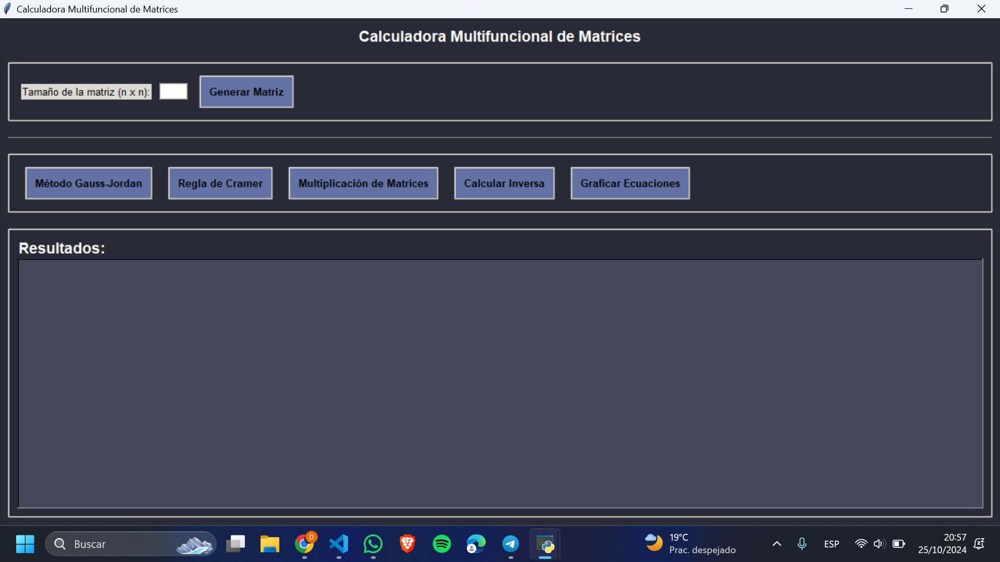

Funcionamiento e instrucciones para ejecutar el programa:

Este proyecto se trata de un programa que calcula matrices por los diferentes métodos gauss jordan y cramer, también realiza multiplicación e inversa de matrices. Implementamos diferentes funciones para que este proyecto no solo calcule matrices, sino que también realiza las combinaciones y permutaciones de la clase de Matemática Discreta, de los cuales las procesa tanto las combinaciones con y sin repetición, como las permutaciones con y sin repetición. 
Este programa funciona mediante lenguaje de programación llamado Python, en el cual se usaron los conocimientos obtenidos en la clase de Algoritmos, como son las importaciones, librerías, clases, bibliotecas y el uso de la programación orientada a objetos. Cada parte del código tiene su funcionamiento único, que del cual se nos hace más fácil realizar los cálculos que deseemos. 
A continuación se especificara un poco mas afondo lo que el programa permite realizar:
Cálculo de operaciones de álgebra lineal:
Generación de matrices personalizadas de tamaño n x n (limitado a tamaños entre 2 y 5).
Aplicación de métodos de cálculo como:
Gauss-Jordan, para la resolución de sistemas de ecuaciones.
Regla de Cramer.
Multiplicación de matrices.
Cálculo de la inversa de una matriz.
Graficación de ecuaciones en 3D (solo para sistemas 3x3).
Cálculo de combinaciones y permutaciones:
Combinaciones con y sin repetición.
Permutaciones con y sin repetición.
Ahora para que este programa sea ejecutable en nuestra computadora debemos seguir los siguientes pasos: 
Instalar dependencias:
Instalamos las bibliotecas tkinter, matplotlib, numpy y math. Estas bibliotecas nos proporcionan funciones especiales al momento de realizar operaciones matemáticas y al manejo de la interfaz gráfica. 
Ejecutar el programa:
Ejecuta el script en un entorno de Python, ya sea en un IDE u otro editor de código, como puede ser Visual Studio Code. 

Interacción con la interfaz:
Al abrir el programa, selecciona una calculadora en el menú principal (Álgebra Lineal, Matemática Discreta o Algoritmos).
En la ventana seleccionada, ingresa los valores y elige la operación deseada, ya sea por método de Gauss Jordan, Cramer o si quieres realizar multiplicación o inversa de las matrices. 
Capturas de pantalla que muestran la interfaz gráfica y ejemplos de uso con los métodos solicitados.

